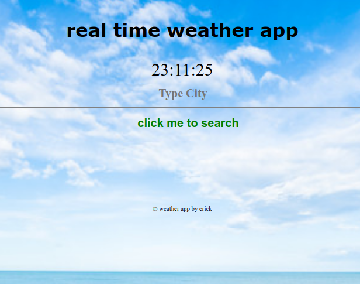
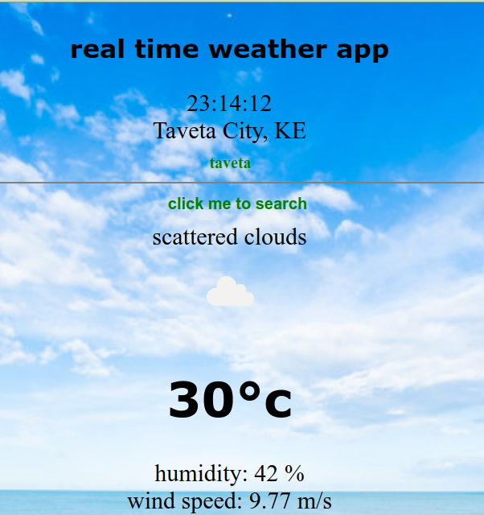

# Weather App

---
- GADS-MWS practice project

- This is also live [here](https://weather-app-kiminza.firebaseapp.com/)

---
This web app consumes the [Weather API](https://openweathermap.org/api) using vanilla JavaScript, HTML and CSS to map the data to front end.

---

